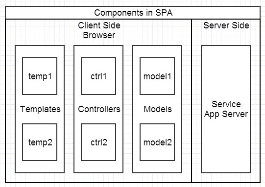
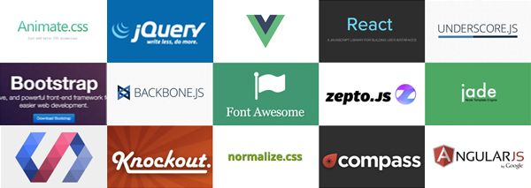
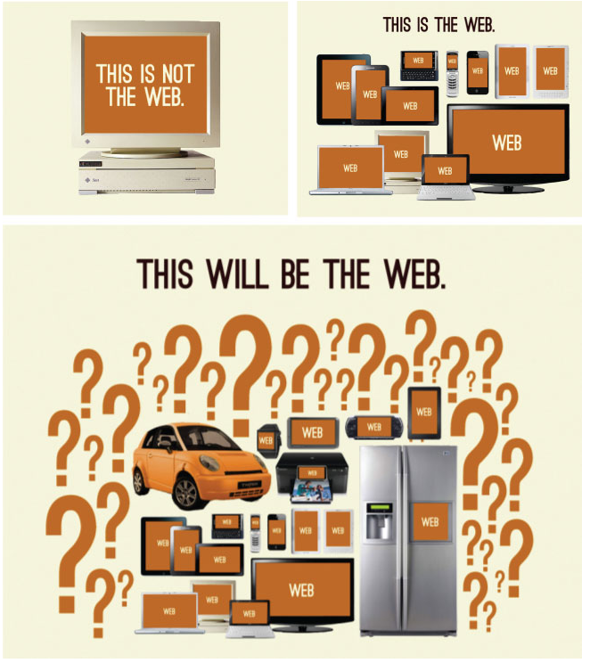
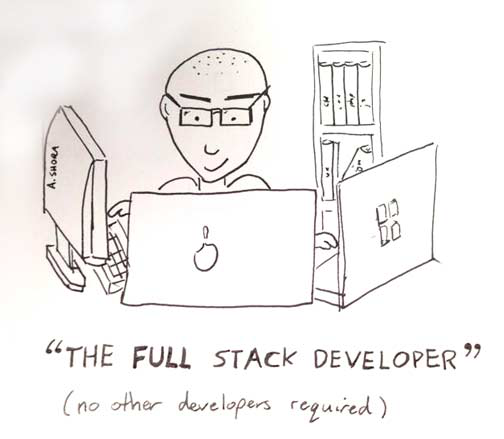
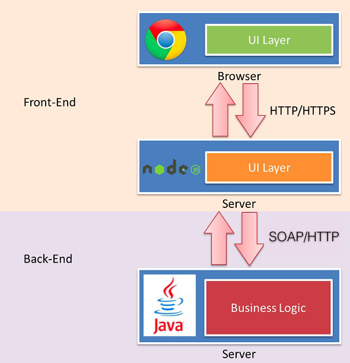

# 前端进化史

> 本章的目的是大家能够对前端开发的范围和技术演进有一个大体概念，算是入门科普读物，多故事，少干货。

## 什么是前端

维基百科是这样说的：前端（front-end）和后端（back-end）是描述进程开始和结束的通用词汇。前端作用于采集输入信息，后端进行处理。计算机程序的界面样式，视觉呈现属于前端。

---

这样好像什么都没说，我们从两方面来看这个问题。

### 团队内的角色定位

- 视觉设计师（字体、颜色、间距、情调、视觉概念和主题）
- UI／交互设计师／信息架构师（也就是线框、所有用户交互和 UI 功能、的指定，信息的架构）
- 前端开发者（也就是编写运行在客户端／设备上的代码）
- 后端开发者（也就是编写运行在服务端的代码）
- QA 工程师
- 数据库管理
- 运维工程师

你可以清楚的看到在一个传统开发团队中，前端开发岗位的位置与分工。

### 各端包括的范围

- PC web：IE/Edge/Chrome/Firefox...
- 移动 web：H5
- 移动 App：混合式开发
- PC App：Electron + Node.js

大前端概念在业界逐渐普及，多个一线互联网企业也纷纷组建“大前端团队”，从开发技术/使用语言/开发模型等多个方面看，将 PC web、移动APP及微信小程序等开发工作交给一个统一的团队来迭代维护有其合理性，但受限于本人知识范围限制，在本 repo 中会偏重 PC web ，其他端开发只会略有涉及，希望后续能有其他同学协助完善其他对应章节。

## 前端演进史

Tim Berners-Lee 建立了世界上第一个网站，可以点击[这里](http://info.cern.ch/hypertext/WWW/TheProject.html)访问[^1]，可以看出这个站点肯定不是某位“前端工程师”写的，实际上那时候并没有这个岗位。但请注意，虽然这个站点非常简陋，但已经体现了后续网页设计的很多基本原则，对 UI 设计感性的同学可以[点击](这里要放一个到“网页设计”md的链接)。

[^1]: 这个站点最初上线时的 url 并不是这个，这里记录的是迁移后的地址，原地址已不可访问。

在 web 出现后的很多年里，都不存在独立的前端开发概念，直到 JavaScript 出现，我们的页面有了“逻辑”，也真正“动”了起来。

我非常喜欢[王下邀月熊](https://github.com/wxyyxc1992) 同学的这份 [Web 开发简史与运行机制](https://github.com/wxyyxc1992/Web-Series/blob/master/%E5%AF%BC%E8%AE%BA/%E5%BC%80%E5%8F%91%E7%AE%80%E5%8F%B2%E4%B8%8E%E5%8F%98%E8%BF%81.md) ，在此放一下王下做的前端发展历史总结表：

| Era/ 时代   | Timeline/ 时间线  | Problems/ 问题        | Innovations/ 创新           | Dominant Browsers/ 主流浏览器                 |
| --------- | -------------- | ------------------- | ------------------------- | ---------------------------------------- |
| 蛮荒时代      | 大概 1996 – 2004 | 基础 DOM 操作，用户交互      | JavaScript 本身，XHR 与 AJAX  | Netscape Navigator, Microsoft Internet Explorer |
| jQuery 时代 | 大概 2004 – 2010 | 增长的网页复杂度，大量的浏览器兼容需求 | 健壮的 DOM 操作，早期的 SPA 单页应用   | Microsoft IE，Mozilla Firefox             |
| SPA 时代    | 大概 2010-2014   | DHTML 过载，大规模数据操作，性能 | MVC 框架，双向数据流，DOM 自动化      | Google Chrome，Microsoft IE ， Mozilla Firefox，Apple Safari |
| 现代        | 大概 2014- 现在    | 性能，复杂应用的状态管理，可用性    | Virtual DOM，单向数据流，类型系统，测试 | Google Chrome，Apple Safari               |

###  jQuery 时代

如上，大约从 jQuery 时代开始，渐渐的开始有了前端开发岗概念，不过在这一阶段，后端工程师主导了整个 web 产品，在这些以ASP.Net  JSP 为代表的技术栈中，前端工作只占很小的部分，重业务逻辑，弱展现弱交互。这时前端开发工程师在MVC中负责 View 层，样式开始多样起来，如下图所示，我们的前辈们主要在各类后端模板中写静态结构和样式：

如上，把整个 HTML 结构写出来，动态内容交由后端工程师填写，俗称“挖坑”。

以 JSP 为例，当时的用户与后端交互大概是这样：

### SPA 时代

后来大概在 2004 年出现了一款跨时代的产品：谷歌邮箱

Ajax 早在1996年就被发明了，但在谷歌邮箱中，我们看到了 SPA[^2] 的雏形，web的体验可以比肩原生 APP。

[^2]: Single Page Application 单页应用

像谷歌邮箱这样的多操作、非刷新渲染的大型 web 项目，给前端开发带来了诸如模块化开发、状态管理等要求，而原先这些都只在后端或其他原生 APP 中才会出现，为了应对挑战，业界陆续出现了如 Backbone、Angular 等解决方案，网站正式进入 web2.0 时代，前端也迎来了生产力的大发展。

如下展示了 SPA 前后端分离架构的交互：

可以看出

- 前后端职责很清晰。前端工作在浏览器端，后端工作在服务端。清晰的分工，可以让开发并行，前端开发不需要后端环境，可以本地开发。后端则可以专注于业务逻辑的处理，输出 RESTful 等接口。
- 前端开发的复杂度可控。前端代码很重，但合理的分层，让前端代码能各司其职。
- 部署相对独立，产品体验可以快速改进。（前端体验的迭代速度一般高于后端接口）

### 现代

在 SPA 出现的时代，前端的架构和所面临的需求已经跟移动 APP 没有什么区别，所以业界也从移动开发领域借鉴了大量诸如 MVC、MVP 等设计思想，各类框架层出不穷[^3]。

[^3]: 无论什么样的设计与分层，都是为了关注点的分离及由此带来的开发与迭代上的方便，在我们团队我们选择了 React + Redux 技术栈，感兴趣的同学可以参[这一章](这里需要链接到“前端框架选型”章节)

## 全端时代

章节开头我们说过本 repo 会着重 PC web，但我们也必须要看到，web 的生产力现在已经远远突破了浏览器的限制，在各个“端”上都有上佳体现：

长久以来，人们为了解决跨平台问题（无论是早期的 linux、Windows、MacOS 三国杀，还是后来的 IOS、Andorid 爱恨情仇）提出了多种多样的技术手段，如大名鼎鼎的 Qt 等，但一直忽略了最常见的 web[^4]：借助浏览器带来的平台无关性，web 几乎可以在任何需要用户界面的设备上提供一致的体验。

[^4]: 其实并不是故意忽略，而是受限于当时的 web 展现效果及设备性能等因素。

## 大前端时代

> JavaScript run everywhere！

JavaScript 的运行环境已经不仅仅局限在各种“端”上，在 nodejs 出现后，它同样可以运行在服务器上[^5]。

[^5]: 与浏览器带来跨平台优势类似，nodejs 通过 v8 引擎提供了可直接在服务器运行的环境。曾经 nodejs 是 JavaScript 介入后端开发的唯一途径，但现在也有了其他选择，比如近期 nodejs 的早期作者 ry 开源的新玩具 [deno](https://github.com/ry/deno)，期待其后续的发展。

现在的前端工程化的需求，离不开 nodejs 等后端语言的支持，比如我们想在后端接口还未开发完成的时候进行数据 mock，免不了要通过 nodejs 编写简单的 http 接口。

另一方面，单纯按照浏览器 - 服务器这样一刀切的按照运行环境划分前后端也不再适应很多实际开发场景，很多产品会在传统的浏览器端和服务器端中间加入 nodejs 层，去处理如权限校验、后端渲染、接口数据处理等事情，这些其实更适合前端工程师去做，接口只负责业务逻辑，不再掺杂页面逻辑。

因此我们的前后端划分则变成了这样：

## 回顾

> 从水下第一个生命的萌芽开始...到石器时代的巨型野兽...再到人类的第一次直立行走，你已经历许多。现在，开启你最伟大的探索吧：从早期文明的摇篮到浩瀚星宇！                       --《文明6》开场词

我们已经回顾了从刀耕火种的荒蛮到现在各类奇技淫巧的框架和类库带来的高生产力，这些并非只是茶余饭后的谈资，事实上只有了解了各类工具产生的时代，去了解他们各自解决的问题，才能更理性的看待现在各开发框架层出不穷的现状：不要再感叹“老子学不动了！”，为了用新框架而去用框架，那你最后什么也没学到，这一个个框架背后的设计理念才是你工作经验中最宝贵的财富。

[Web 开发简史与运行机制]: https://github.com/wxyyxc1992/Web-Series/blob/master/%E5%AF%BC%E8%AE%BA/%E5%BC%80%E5%8F%91%E7%AE%80%E5%8F%B2%E4%B8%8E%E5%8F%98%E8%BF%81.md

PS. 这篇文章来自于我去年一次团队内分享的 PPT，写的过程中借鉴了多篇网络上的文章（包括引用的图片在内），但是当时并没有保存链接，在此深表歉意。如果大家有发现图片等确切来自于某篇文章，请及时联系我，我会与原作者联系，在下方添加参考链接或删去对应内容，感谢！