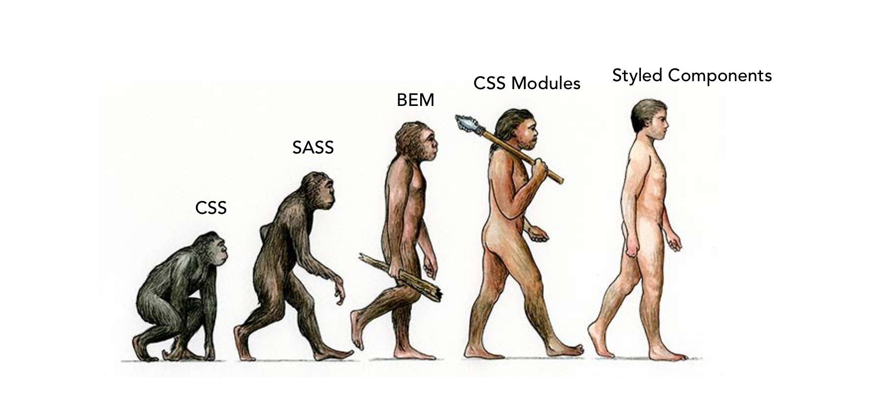

# CSS Modules

在 CSS 章节，我们提到了传统 CSS 的局限性，在 React、Web Componet 逐渐流行的现在，我们越来越不能忍受样式污染带来工程问题：我们已经习惯了用“组件”来封装 UI 交互和逻辑，通过它们的组合来生成丰富多样的页面，但 CSS 由于其语言本身的特性，一直不能很好的适应组件化。



以上图片来自 [CSS Evolution: From CSS, SASS, BEM, CSS Modules to Styled Components](https://medium.com/@perezpriego7/css-evolution-from-css-sass-bem-css-modules-to-styled-components-d4c1da3a659b)，本文内容也多有参考。

> 前端能够看懂的笑话：“两个 CSS 参数走进一家酒吧（ bar ），另一家酒吧的凳子就倒了。”

记得刚开始在项目里写 CSS 的时候，为了防止样式污染，我总想给 Class 选择器起一个“独一无二”的名字，为此绞尽脑汁但过段时间后还是免不了会出现页面样式覆盖的问题。在讨论所有这些旨在扩展 CSS 以服务前端组件化开发的解决方案之前，我们有必要说下 BEM。

## BEM

> 唯一性是可重用的前提：你封装的组件在这个页面显示是正常的，我在别的页面引入了这个组件，由于本页面与组件内样式冲突，导致显示效果与预期不符，那我们可以说这个组件不可重用。

俄罗斯公司 Yandex 受困于长期迭代大型站点，CSS 很难维护的问题，总结他们的经验，提出了一套规范和相应的工具，当然现在我们觉得其中依然有意义的是其中的命名规范。

详细内容可以看 《[Block, Element, Modifier](http://bem.info/method/definitions/)》，或者看这篇[译文](BEM.md)

简单来说，BEM 提供了更容易理解的语义化 CSS 选择器命名规范，结合 Web Componet 组件化封装，我们可以将样式污染出现的概率降到很低，同时不会增加手工维护的工作量。

## CSS Modules

BEM 帮我们规范了 CSS 命名，但在 React 技术栈的项目中，我们更常用 CSS Modules 等工具帮我们自动化的完成封装工作，比如在项目中我们经常这样完成组件封装：

```css
.title {
    color: red;
  }
```


```javascript 
import styles from './index.css';
function H1() => (<div className={styles.title}>haha</div>)
```

编译结束后，浏览器里看到的 HTML 内容变为：

```html
<div class="title___NcS6x">
  haha
</div>
```

当然 CSS 文件中的类名也会变成：

```css
.title___NcS6x {
    color: red;
 }
```


## 参考链接

[BEM 官网]: http://getbem.com/	"BEM"
[CSS Evolution: From CSS, SASS, BEM, CSS Modules to Styled Components]: https://medium.com/@perezpriego7/css-evolution-from-css-sass-bem-css-modules-to-styled-components-d4c1da3a659b	"CSS Evolution: From CSS, SASS, BEM, CSS Modules to Styled Components"
[CSS Modules 用法教程 - 阮一峰]: http://www.ruanyifeng.com/blog/2016/06/css_modules.html	"CSS Modules 用法教程"
[CSS Modules]: https://github.com/css-modules/css-modules	"CSS Modules"

